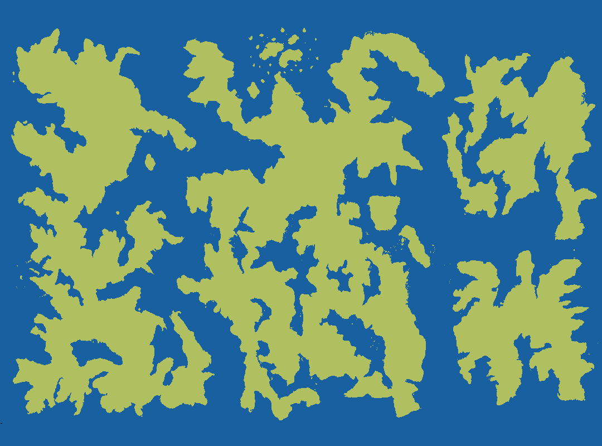

# Geography

## Continents

Kyroda is made up of four continents. To the west is Sohcahtoa, which is home to the [gryphons](gryphons.md) in the north and the [kholu](kholu.md) in the south. The central condinent, Tansincos, is home to the [nagas](nagas.md) in the north, and the [marstels](marstels.md) in the south. The eastern continents are Pem in the north, home of the [dragons](dragons.md), and Das to the south, home of the [hidegvins](hidegvins.md), also known as the Eastern Twins.

The land masses are built into irregular, unfitting chunks due to an upheaval of islands containing large deposits of levitite, a mineral that repels against the planet's core. Over time, these chunks of land formed into stable skylands positioned around Kyroda. This has also caused teh continents to form many small seas.