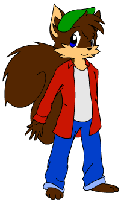
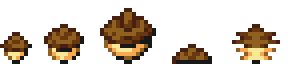

# Midi Waffle

&nbsp;

**FULL NAME:** Midi Valbelgian Waffle  
**RACE:** [Kholu](kholu.md)  
**SEX:** Male  
**AGE:** 14  
**HEIGHT:** 1.22m / 4'0"  
**WEIGHT:** ...  
**COLORS:** Brown fur, tan underfur, blue eyes  
**FACTION:** Cloud Chasers, formerly Cold Front

## BIO:
A young bounty hunter, formerly a pirate. After losing his parents in a [biometal](biometal.md) attack, he was found by the [Cold Front](coldfront.md) and taken in for his magical potential. Although he stayed with them for several years, he was never fully committed, and always had his eyes open for an opportunity to escape from them, biding his time until he felt he was capable of taking care of himself.

After encountering [Hunter](hunter.md) at Gulsandur, the two quickly bonded and set out together, using a repainted Cold Front dropship as their new mobile home.

## GAMEPLAY:

### Bombs:
Midi is the most straightforward platformer character. He has lower physical attack power and depends more on his elemental bombs that come in four types:

* Normal - A pure kineetic explosion that deals damage but does not have an elemental effect. When charged, it can be launched at a greater distance and deals extra damage. This type costs the least amount of energy to use.
* Fire - Adds a burning effect that slowly damages enemies over time. Can also be used to burn down certain plant matter and weaker ice blocks to open passages. When charged, it creates a bigger explosion and deals extra damage.
* Shock - Adds a static effect that causes enemies to pass along an electric charge that damages them when spread, and slows enemies down through paralisys. Electricity can also be used to power conduits and charge machinery. Underwater, the static effect can jump further. When charged, it creates a ball of lightning that lingers and launches lightning bolts at enemies.
* Ice - Adds a freezing effect that stops enemies cold when their health is low. Flying enemies will fall and take damage when frozen, except when under water. When charged, it creates a swirling blizzard that freezes all enemies caught in it, regardless of health (except bosses).
* Dark - Creates a gravity well that pulls in enemies and damages them with intense pressure. Cannot be used normally, but must be built up by taking damage. To prevent accidentally wasting it, it can only be fired as a charged shot.

His bombs can be dispensed in several ways:

* Throwing - The basic attack he starts with. It can be aimed in eight directions, and throws bombs in an arc.
* Charging - Midi has two charge levels. The more he charges, the more damage it'll do, and the bigger the explosion, at the cost of additional energy, and the larger nut being larger and heavier, reducing its thrown range..
* Spinning - When on the ground, pressing down and forward while throwing will instead spin the bomb like a top along the ground, making it much easier to hit enemies that are too low to easily hit by throwing.
* Planting - Midi can have one landmine planted at a time. This is done by holding down while standing and pressing the bomb button. If Midi jumps while standing on a mine, it will explode under him, launching him into the air for a much higher jump.
* Dropping - While in his transphere, Midi will leave a remote or time bomb on the ground. Rapidly dropping and detonating remote bombs will allow limited bomb laddering.
* Missile - An alternate mode to charging that causes bombs to defy gravity by self propelling using the stem's flame. Can be further upgraded to add homing capability.

Even when charged, Midi's bombs suffer a speed reduction when under water. A second element can be set to Midi's off hand, similar to Zero's subweapon in the Mega Man Zero games.

### Transphere:

Midi's transphere is basically a morphball, but with two differences to its Metroid counterpart. One, it does not play a spinning animation when stationary, and instead, rolls according to the speed its travelling at. Two, it obeys slopes, and will gain speed depending on the direction of the slope it is on. It can move at the same speeds Midi can while running, but has lower friction because it's a ball.

The explanation of why he does not get dizzy is that because he is not actually spinning himself, only the metal plates around him. His body is gyroscopically stabilized inside. The transphere can be used in biometal nests to quickly travel around through pneumatic tubes.

Some elements Midi learns also give him a new ability for his transphere.

* Normal - Drops a bomb that bumps Midi into the air. Can be chained as long as he has mana.
* Fire - Boosts forward and deals damage to enemies on contact.
* Ice - TBD
* Shock - Magnetizes the sphere to stick to special rails

### Other Abilities:
* Grappling Hook - Can be assigned to Midi's off hand, allowing him to swing from points set against the background or walls.
* Monkey Bars - Some ceilings can be grabbed and traversed this way.
* Bomb Hover - Midi spawns an acorn under each foot and stands on them in the air for a moment. Horizontal momentum is preserved while hovering, and falling is cancelled until the bombs despawn. Hover energy is restored when on the ground or clinging to a wall.
* Wall Kick - Pressing jump against a wall lets Midi kick off of it. Holding towards it allows him to climb. Spiked or slippery walls can't be climbed. Wall kicking will be restricted from single-wall climbing until the hover bomb is learned.