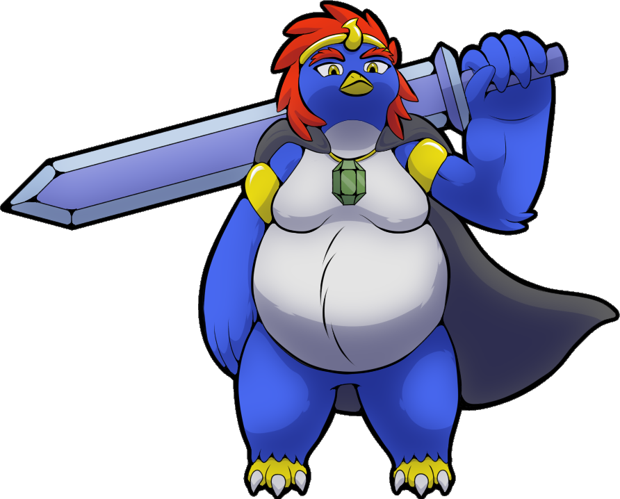

# Emperor Pendragon

&nbsp;

**FULL NAME:** Emperor Arthur Pendragon  
**RACE:** [Hidegvin](hidegvins.md)  
**SEX:** Male  
**AGE:** 48  
**HEIGHT:** 6'0"  
**WEIGHT:** ...  
**COLORS:** Blue-dyed feathers, white underbelly, gold eyes  
**FACTION:** Cold Front

**BIO:**

Arthur Pendragon is the founder and leader of the Cold Front. After discovering he was the descendant of one of the magitech weapon crafters during the [second era](history.md), he set out to find the means to claim the ancient weapons for himself. His original plan for them was simply to use them as weapons of conquest, but after meeting Dr. Quincey and seeing the evidence of the [biometals](biometals.md) return, his plan changed to use the weapons to defeat them and take the role of world ruler as payment.

After a raid on a passenger airship, Pendragon encountered and defeated [Midi](midi.md), then took the young [kholu](kholu.md) back with him to be trained in piracy and raised to be a powerful asset for the Cold Front.

In battle, Pendragon is ruthless and merciless. Even when negotiating a surrender, he will twist any word he can to make his opponent agree to anything he wishes. He has no tolerance for scavengers, raiders, and rival pirates who threaten the prosperity of his own faction, and will bring a swift end to them when he has the chance. However, he also has the patience and foresight to allow his opponents to weaken each other before swooping in and finishing both, and will even coordinate such conflicts to ensure maximum ease of victory for his own forces.

While he normally leads as a captain and commander from within his ship (but never under those titles; he is an emperor first and foremost to his subjects), he is no slouch when fighting on his own. Like the rest of the [hidegvins](hidegvins.md) under him, he specializes in ice magic. By creating ice that is denser than normal, he can made armor and weapons that are as hard as steel at a fraction of the weight. With this, he can conjure a broadsword that is as long as he is tall and wield it as easily as a normal longsword. While he can also conjure a shield, he tends to hold his sword in both hands, and instead creates walls of ice between himself and his opponent while he winds up a wide swing that would normally leave him open to attack, dispelling the wall right before contact so his attack can land the second his defence goes down.

Pendragon is actually a little blue breed like his subordinates, and has giantism.
